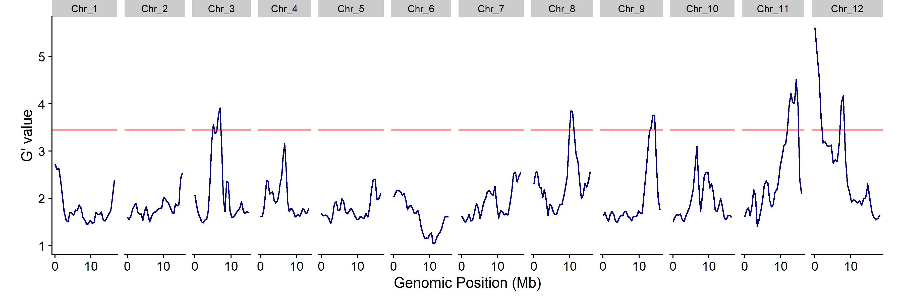
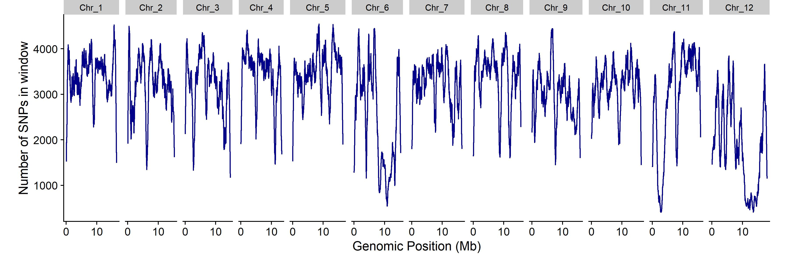
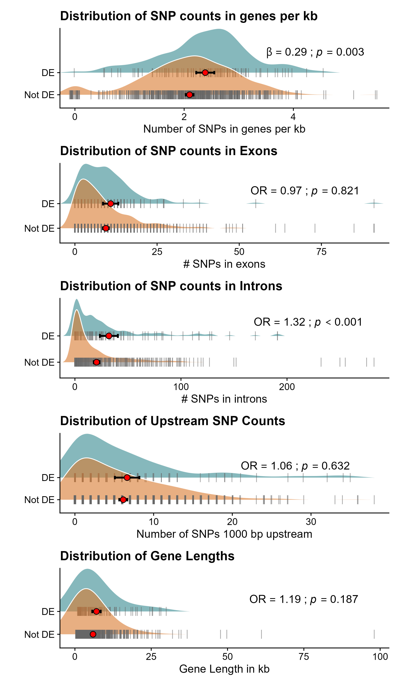
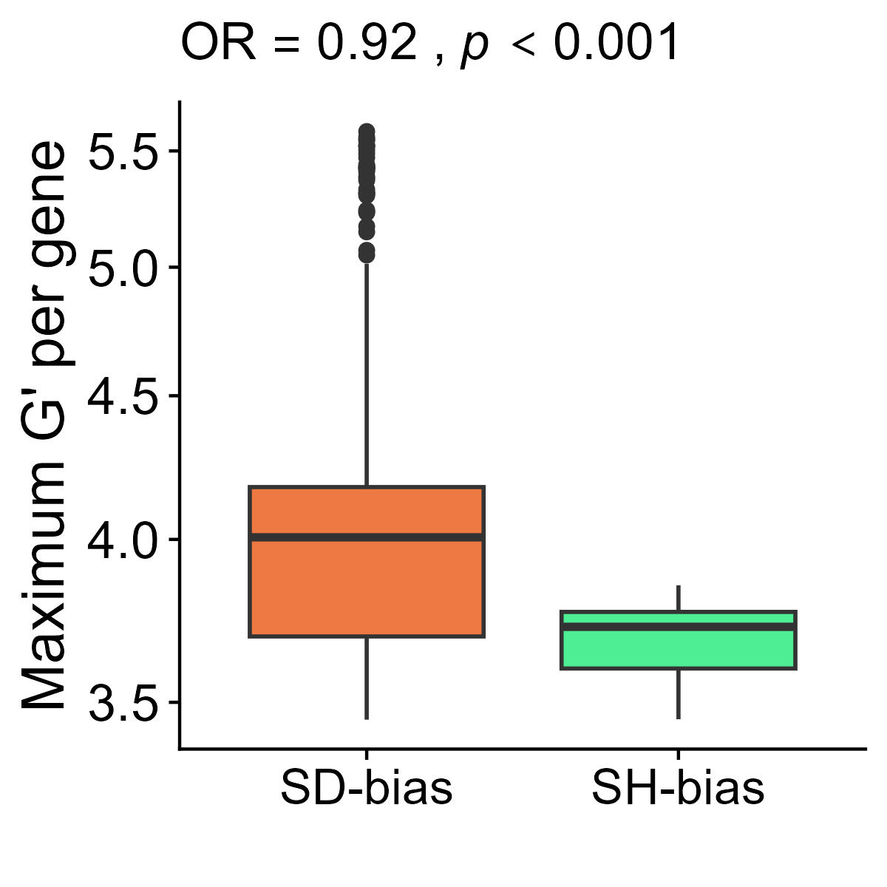
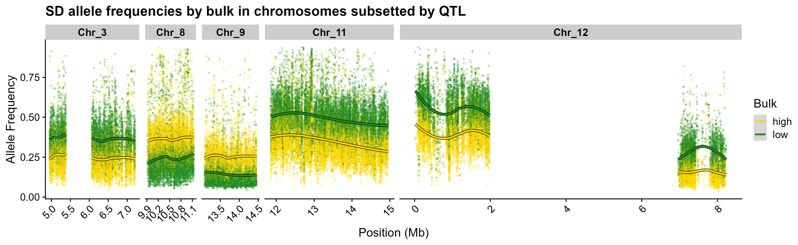

# Bulk-Segregant QTL Mapping of Hypoxia Tolerance in *Tigriopus californicus*

Bulk segregant analysis (BSA) / QTL-seq mapping of loci underlying hypoxia tolerance in the intertidal copepod
*Tigriopus californicus*, using pooled whole-genome sequencing of phenotypically extreme bulks from F22+ hybrids
between two source populations (SD and SH). Full analysis code: [`QTLseq_BSA_script.R`](QTLseq_BSA_script.R).

## Study design

Two DNA pools ("High Pcrit" and "Low Pcrit" bulks, sampled from opposite tails of the hypoxia-tolerance phenotype
distribution where Low Pcrit means "more tolerant") were sequenced and their allele counts merged into a single table of biallelic SNPs. Genome-wide
divergence between bulks was quantified across 12 chromosomes using [QTLseqr](https://github.com/bmansfeld/QTLseqr)'s
G′ statistic (750 kb sliding windows), and significant regions were annotated with [SnpEff](https://pcingola.github.io/SnpEff/)
and cross-referenced against gene models, a prior RNA-seq differential-expression time series, and curated
functional gene sets.

## QTL mapping

G′ was calculated genome-wide and significant QTLs called at α = 0.01:



| Chromosome | QTL | Region (Mb) | Length (Mb) | # SNPs | Max G′ | Mean q-value |
|---|---|---|---|---|---|---|
| Chr_11 | 1 | 11.86 – 14.95 | 3.10 | 15,510 | 4.52 | 0.0020 |
| Chr_12 | 2 | 0.02 – 1.98 | 1.96 | 6,601 | **5.62** | 0.0019 |
| Chr_12 | 3 | 6.96 – 8.23 | 1.27 | 3,560 | 4.17 | 0.0030 |
| Chr_3 | 4 | 4.95 – 5.38 | 0.43 | 2,220 | 3.57 | 0.0086 |
| Chr_3 | 5 | 6.07 – 7.21 | 1.14 | 4,718 | 3.92 | 0.0049 |
| Chr_8 | 6 | 9.92 – 11.14 | 1.22 | 6,534 | 3.85 | 0.0042 |
| Chr_9 | 7 | 13.08 – 14.45 | 1.37 | 4,505 | 3.77 | 0.0057 |

**7 significant QTLs** spanning **5 of 12 chromosomes**, mapping to **721 candidate genes**.

<details>
<summary>Supplementary QC/diagnostic plot</summary>

SNP density across the genome (useful for spotting poorly-sequenced regions):



</details>

## Zooming in on a candidate gene

Each QTL was annotated down to the SNP level with SnpEff, letting individual candidates be inspected in genomic
context. Below, *cyp6a14* (TCAL_08505) on Chr_11 is shown from three angles — a zoomed view of the gene itself,
its immediate surrounding neighborhood, and a view from IGV showing SNPs causing a stop lost mutation at the end of the gene — with ΔSNP-index plotted
alongside the gene model throughout:


(Other candidate genes — *Tret1*, *Lcc2*, *GFPT1*, *Gnpda1*, *ATPsynCf6*, *Cha*, *Oxa1l*, *mesh* — were profiled
the same way.)

## Do QTL genes line up with an independent RNA-seq study?

Candidate genes were cross-referenced against a prior RNA-seq differential-expression (DE) time series. **101 of
721 candidate genes (14%)** were also DE in that study — a modest, non-significant enrichment over the
genome-wide background rate (Fisher's exact test, OR = 1.18, p = 0.13). Genes that *did* overlap, however, carry
significantly more SNPs per gene and significantly more intronic SNPs specifically, both after adjusting for gene
length (models above), along with a higher burden of "modifier"-impact SNPs.


## Modeling gene-level SNP architecture in QTL genes that overlap with expression data

Beyond calling QTLs, the 721 candidate genes were characterized with a series of generalized linear models, each
matched to the response variable's distribution:

- **Quasi-Poisson regression** (with `offset(log(gene_length_kb))`) for SNP counts falling in different genomic
  contexts (exons, introns, upstream regions, SnpEff impact categories) — the offset converts raw counts into an
  implicit per-kb rate while keeping the response on its natural count scale.
- **Gamma regression** (log link) for continuous, strictly-positive metrics like gene length and per-gene peak G′.
- **Linear models** on variance-stabilized (sqrt- or log-transformed) ratios where a Gaussian residual structure
  was more appropriate.

Each model compared two groupings of interest: whether a candidate gene overlapped an independent RNA-seq
differential-expression (DE) time series, and which source population's allele rose in frequency across a QTL
(SD- vs. SH-biased). Fitted group means and 95% CIs from these models are overlaid on raw per-gene distributions:

| DE-overlap comparison | Population-bias comparison |
|---|---|
|  |  |

Three representative model fits, in full:

<details>
<summary><b>In-gene SNP density vs. RNA-seq DE overlap</b> — quasi-Poisson, gene-length offset</summary>

DE-overlapping genes carry ~21% more SNPs per gene than expected from gene length alone.

```r
summary(ingene.mod)
# n_in_gene ~ In_time_series + offset(log(gene_length_kb)), family = quasipoisson

Coefficients:
                   Estimate Std. Error t value Pr(>|t|)    
(Intercept)         1.61493    0.02403  67.212  < 2e-16 ***
In_time_seriesTRUE  0.18906    0.05517   3.427 0.000645 ***
---
(Dispersion parameter for quasipoisson family taken to be 10.68484)

    Null deviance: 7884.2  on 720  degrees of freedom
Residual deviance: 7763.5  on 719  degrees of freedom
```

</details>

<details>
<summary><b>Intronic SNP burden vs. RNA-seq DE overlap</b> — quasi-Poisson, gene-length offset</summary>

DE-overlapping genes carry ~32% more intronic SNPs (length-adjusted) than non-overlapping genes.

```r
summary(inintron.mod)
# n_introns ~ In_time_series + offset(log(gene_length_kb)), family = quasipoisson

Coefficients:
                   Estimate Std. Error t value Pr(>|t|)    
(Intercept)         1.23565    0.02976   41.52  < 2e-16 ***
In_time_seriesTRUE  0.27580    0.06599    4.18 3.28e-05 ***
---
(Dispersion parameter for quasipoisson family taken to be 11.21765)

    Null deviance: 8903.0  on 720  degrees of freedom
Residual deviance: 8717.6  on 719  degrees of freedom
```

</details>

<details>
<summary><b>Peak QTL signal (max G′) vs. population bias</b> — Gamma GLM, log link</summary>

SH-biased QTLs have ~9% lower peak G′ than SD-biased QTLs — the strongest population-bias effect in the dataset.

```r
summary(gprime.mod.pb)
# max_Gprime ~ bias, family = Gamma(link = "log")

Coefficients:
             Estimate Std. Error t value Pr(>|t|)    
(Intercept)  1.395559   0.004461  312.82   <2e-16 ***
biasSH_bias -0.088774   0.008022  -11.07   <2e-16 ***
---
(Dispersion parameter for Gamma family taken to be 0.009911458)

    Null deviance: 7.7406  on 720  degrees of freedom
Residual deviance: 6.5406  on 719  degrees of freedom
AIC: 628.88
```

</details>

## Which population's allele rose in frequency?

Within each QTL, SD allele frequency was tracked separately in the low- and high-Pcrit bulks, letting each QTL be
classified as SD- or SH-biased depending on which source population's allele was higher in the low-Pcrit bulk. The SD allele is clearly preferred in the low-Pcrit bulk across most of the
significant QTL regions.



<details>
<summary>Plotting code</summary>

```r
AF_by_QTL_and_bulk_plot_SD_only <- qtl_snps_subset_long %>%
  filter(population == "SD") %>%
  dplyr::mutate(POS_Mb = POS / 1e6) %>%
  ggplot(aes(x = POS_Mb, y = frequency, color = treatment)) +
  geom_point(alpha = 0.2, size = 0.4) +
  geom_smooth(method = "loess", se = FALSE, aes(group = interaction(treatment, qtl)), color = "black", linewidth = 1.5) +
  geom_smooth(method = "loess", se = TRUE, aes(group = interaction(treatment, qtl)), linewidth = 1) +
  scale_color_manual(values = c("gold", "forestgreen")) +
  facet_grid(~CHROM, scales = "free_x", space = "free_x") +
  labs(x = "Position (Mb)", y = "Allele Frequency", color = "Bulk") +
  theme(axis.text.x = element_text(angle = 45, hjust = 1), strip.text = element_text(face = "bold")) +
  ggtitle(label = "SD allele frequencies by bulk in chromosomes subsetted by QTL")

ggsave("AF_of_SD_by_bulk_plot.jpg", plot = AF_by_QTL_and_bulk_plot_SD_only, width = 13, height = 4, dpi = 300)
```

</details>

Of the 721 candidate genes, **498 (69%) fall in SD-biased QTLs** and **223 (31%) fall in SH-biased QTLs**
(Chr_3/11/12 vs. Chr_8/9) — a split that turned out to be predictive of QTL signal strength (model above).

## What are the QTL genes doing functionally?

GO enrichment (`topGO`, Fisher's exact test, BP ontology) was run on the 721 candidate genes and visualized with
`rrvgo` after semantic-similarity clustering:


Targeted overlap tests against curated functional gene sets (candidate vs. genome-wide background, Fisher's exact
test) did not show significant enrichment for any single category tested, though point estimates trended in
different directions:

| Gene set | Odds ratio | p-value |
|---|---|---|
| Mitochondrial-targeted proteins | 0.83 | 0.43 |
| Cuticle / chitin processing | 1.07 | 0.75 |
| Glycolysis & related processes | 0.53 | 0.23 |

## Methods at a glance

- **QTL calling:** [`QTLseqr`](https://github.com/bmansfeld/QTLseqr) G′ statistic, 750 kb sliding windows, α = 0.01
- **Variant annotation:** [SnpEff](https://pcingola.github.io/SnpEff/)
- **Gene-level modeling:** GLMs (quasi-Poisson with length offsets, Gamma with log link) and linear models on
  transformed ratios, comparing candidate-gene subgroups (RNA-seq DE overlap, SD-/SH-population bias)
- **GO enrichment:** `topGO` (weight01 algorithm, Fisher's exact test) + `rrvgo` (Wang semantic similarity,
  custom `org.Tcalifornicus.eg.db` OrgDb) for visualization
- **Visualization:** `ggplot2`, `ggridges`, `gggenes`, `patchwork`

Full pipeline, including data wrangling, filtering thresholds, and every model/plot summarized above, is in
[`QTLseq_BSA_script.R`](QTLseq_BSA_script.R).
